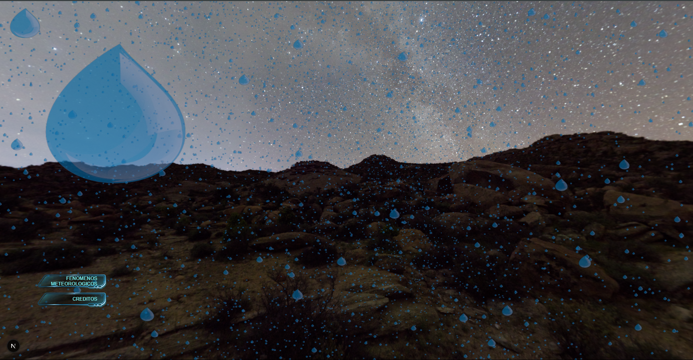
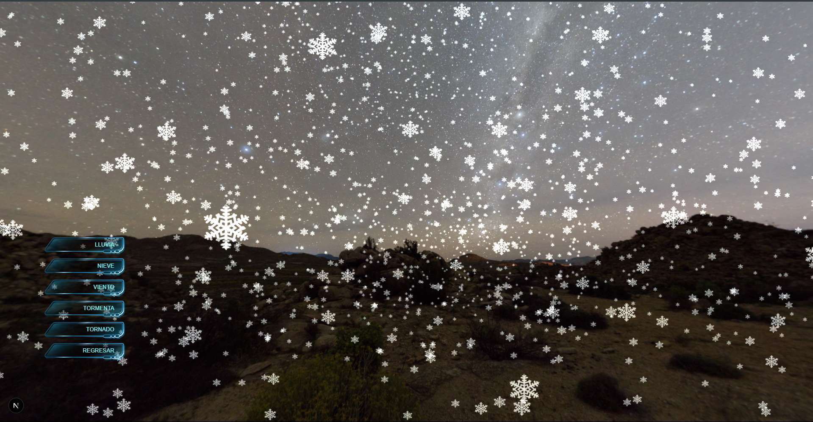

## 🌍  Meteorological Simulation 3D 🌍 
###  :star: This project was created to explore and learn about 3D Simulation. It´s a school project and the goal is genereate more knowlegde in tools such as React and TypeScript because we are Web Developers, and we are very intrigued to develop with Three.js Librery with WebGL Class, last one be the 'standard' on Browsers :stars:

## 🛠️ Technologies  
- [Three.js](https://threejs.org/)  
- React + TypeScript  
- WebGL
- Next.js

  
# 🚀 How to run the project
1. :boom: clone repository: git clone https://github.com/Luis-Alvarezz/Simulation-meteorological.git
2. :shinto_shrine: Install dependences: npm install
3. :zap: Execute the project: npm run dev 

## 📸 Screenshot  
  
  
